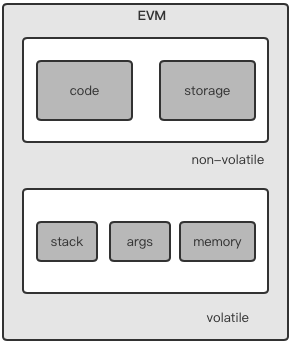
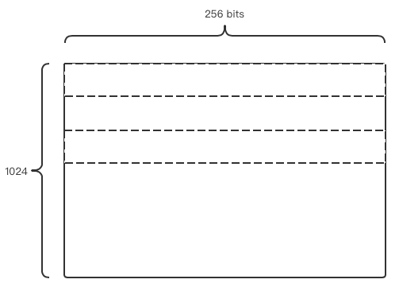

### 一、概述  
以太坊是一种基于栈的虚拟机，基于栈的虚拟机数据的存取为先进后出（也即后进先出），在后面介绍 EVM 指令的时候会看到这个特性。同时基于栈的虚拟机实现简单，移植性也不错，这也是以太坊选择基于栈的虚拟机的原因。  
了解EVM数据结构的存储方式有便于写合约程序时可以更省资源和gas。


### 二、EVM数据管理
    

&emsp;&emsp;可以看到 code 和 storage 里存储的数据是非易失的（non-volatile），而 stack，args，memory 里存储的数据是易失的 (volatile)，其中 code 的数据是智能合约的二进制源码，是非易失的很好理解，部署合约的时候 data 字段也就是合约内容会存储在 EVM 的 code 中。  
&emsp;&emsp;如果要操作这些存储结构里的数据，就需要用到 EVM 指令，由于 EVM 的操作码被限制在一个字节以内，所以 EVM 最多容纳 256 条指令，目前 EVM 已经定义了约 142 条指令，还有 100 多条用于以后的扩展。这 142 条指令包括了算法运算，密码学计算，栈操作，memory，storage 操作等。  
&emsp;&emsp;简单来说，可以分为两种数据存储方式，一种就是非易失的，像电脑的硬盘，对应是区块链上的数据，一种是易失的，像电脑的内存，对应就是运行合约时EVM分配的内存。  
&emsp;&emsp;下面来看看每种存储方式有什么不一样和怎么使用

* Strack(栈)
   
&emsp;&emsp;stack是免费使用，不需要gas，主要用来保存局部变量，每个栈元素占256位，栈最大长度1024
    * Pop 指令（操作码 0x50）用来从栈顶弹出一个元素；
    * PushX 指令用来把紧跟在后面的 1-32 字节元素推入栈顶，Push 指令一共 32 条，从 Push1（0x60）到 Push32（0x7A），因为栈的一个字是 256bit，一个字节 8bit，所以 Push 指令最多可以把其后 32 字节的元素放入栈中而不溢出。
    * DupX 指令用来复制从栈顶开始的第 1-16 个元素，复制后把元素在推入栈顶，Dup 指令一共 16 条，从 Dup1（0x80）到 Dup16（0x8A）。
    * SwapX 指令把栈顶元素和从栈顶开始数的第 1-16 个元素进行交换，Swap 指令一共 16 条，从 Swap1（0x01）一直到 Swap16（0x9A）。

* Args(参数)  
&emsp;&emsp;args 也叫 calldata，是一段只读的可寻址的保存函数调用参数的空间，与栈不同的地方的是，如果要使用 calldata 里面的数据，必须手动指定偏移量和读取的字节数。  
&emsp;&emsp;EVM 提供的用于操作 calldata 的指令有三个：
    * calldatasize 返回 calldata 的大小。
    * calldataload 从 calldata 中加载 32bytes 到 stack 中。
    * calldatacopy 拷贝一些字节到内存中。  

&emsp;&emsp;通过一个合约来看一下如何使用 calldata，假如我们要写一个合约，合约有一个 add 的方法，用来把传入的两个参数相加，通常会这样写。
```
pragma solidity ^0.5.1;

contract Calldata {
  function add(uint256 a, uint256 b) public view returns (uint256) {
    return a + b;
  }
}
```
当然我们也可以用内联汇编的形式这样写。
```
contract Calldata {
 function add(uint256 a, uint256 b) public view returns (uint256) {
   assembly {
     let a := mload(0x40)
     let b := add(a, 32)
     calldatacopy(a, 4, 32)
     calldatacopy(b, add(4, 32), 32)
     result := add(mload(a), mload(b))
   }
 }
}
```
&emsp;&emsp;首先我们我们加载了 0x40 这个地址，这个地址 EVM 存储空闲 memory 的指针，然后我们用 a 重命名了这个地址，接着我们用 b 重命名了 a 偏移 32 字节以后的空余地址，到目前为止这个地址所指向的内容还是空的。 
calldatacopy(a, 4, 32) 这行代码把 calldata 的从第 4 字节到第 36 字节的数据拷贝到了 a 中，同样 calldatacopy(b, add(4, 32), 32) 把 36 到 68 字节的数据拷贝到了 b 中，接着 add(mload(a), mload(b)) 把栈中的 a，b 加载到内存中相加。最后的结果等价于第一个合约。  
&emsp;&emsp;而为什么 calldatacopy(a, 4, 32) 的偏移要从 4 开始呢？在 EVM 中，前四位是存储函数指纹 (函数选择器) 的，计算公式是 bytes4 (keccak256 (“add (uint256, uint256)”))，从第四位开始才是 args。

* Memory(内存)
&emsp;&emsp;Memory 是一个易失性的可以读写修改的空间，主要是在运行期间存储数据，将参数传递给内部函数。内存可以在字节级别寻址，一次可以读取 32 字节。   
&emsp;&emsp;EVM 提供的用于操作 memory 的指令有三个：
    * mload 加载一个字从 stack 到内存；
    * sstore 存储一个值到指定的内存地址，格式 mstore（p，v），存储 v 到地址 p；
    * mstore8 存储一个 byte 到指定地址；   

&emsp;&emsp;当我们操作内存的时候，总是需要加载 0x40，因为这个地址保存了空闲内存的指针，避免了覆盖已有的数据。

* Storage(存储)

&emsp;&emsp;Storage 是一个可以读写修改的持久存储的空间，也是每个合约持久化存储数据的地方。Storage 是一个巨大的 map，一共 2^256 个插槽，一个插糟有 32byte。    
&emsp;&emsp;EVM 提供的用于操作 storage 的指令有两个：

    * sload 用于加载一个字到 stack 中；
    * sstore 用于存储一个字到 storage 中；

&emsp;&emsp;solidity 将定义的状态变量，映射到插糟内，对于静态大小的变量从 0 开始连续布局，对于动态数组和 map 则采用了其他方法，下面介绍。

### 三、状态变量
Storage 初始化的时候是空白的，默认是 0。

```
pragma solidity ^0.5.1;

contract C {
  uint256 a;
  uint256 b;
  uint256 c;
  function test() public {
    c = 0xc0fefe;
  }
}
```
用 solc --asm --optimize test.sol 编译合约，可以看到；
```
    ... ...

    tag_5:
        /* "test.sol":112:120  0xc0fefe */
      0xc0fefe
        /* "test.sol":108:109  c */
      0x02
        /* "test.sol":108:120  c = 0xc0fefe */
      sstore
        /* "test.sol":79:125  function test() public {... */
      jump	// out

      ... ...
```
这段汇编执行的是 sstore(0x02, 0xc0fefe)，把 0xc0fefe 存储到 0x02 这个位置，在 EVM 中声明变量不需要成本，EVM 会在编译的时候保留位置，但是不会初始化。  
`当通过指令 sload 读取一个未初始化的变量的时候， 不会报错，只会读取到零值 0x0。`

### 四、struct结构体
```
pragma solidity ^0.5.1;
contract C {
 struct Tuple {
    uint256 a;
    uint256 b;
    uint256 c;
  }
  Tuple t;
  function test() public {
    t.c = 0xC0FEFE;
  }
}
```
编译得到:
```
    ... ...

    tag_5:
        /* "test.sol":151:159  0xC0FEFE */
      0xc0fefe
        /* "test.sol":145:148  t.c */
      0x02
        /* "test.sol":145:159  t.c = 0xC0FEFE */
      sstore
        /* "test.sol":116:164  function test() public {... */
      jump	// out

      ... ...
```
可以看到编译结果跟状态变量的结果一致

### 五、定长数组
```
pragma solidity ^0.5.1;
contract C {
  uint256[6] numbers;
  function test() public {
    numbers[5] = 0xC0FEFE;
  }
}
```
编译得到:
```
    ... ...
    tag_5:
        /* "test.sol":104:112  0xC0FEFE */
      0xc0fefe
        /* "test.sol":99:100  2 */
      0x02
        /* "test.sol":91:112  numbers[2] = 0xC0FEFE */
      sstore
        /* "test.sol":62:117  function test() public {... */
      jump	// out
    ... ...
```
固定大小的变量都是尽可能打包成 32 字节的块然后依次存储的，而一些类型是可以动态扩容的，这个时候就需要更加灵活的存储方式了，这些类型有映射（map），数组（array），字节数组（Byte arrays），字符串 (string)。


### 六、映射
```
pragma solidity ^0.5.1;

contract Test {
 mapping(uint256 => uint256) items;

 function test() public {
  items[0x01] = 0x42;
 }
}
```

```
    ... ...
    tag_5:
        /* "test.sol":111:115  0x01 */
      0x01
        /* "test.sol":105:110  items */
      0x00
        /* "test.sol":105:116  items[0x01] */
      swap1
      dup2
      mstore
      0x20
      mstore
        /* "test.sol":119:123  0x42 */
      0x42
        /* "test.sol":105:116  items[0x01] */
      0xada5013122d395ba3c54772283fb069b10426056ef8ca54750cb9bb552a59e7d
        /* "test.sol":105:123  items[0x01] = 0x42 */
      sstore
        /* "test.sol":79:127  function test() public {... */
      jump	// out
      ... ...
```
&emsp;&emsp;分析一些这段汇编就会发现 0x42 并不是存储在 key 是 0x01 的位置，取而代之的是 0xada5013122d395ba3c54772283fb069b10426056ef8ca54750cb9bb552a59e7d 这样一段地址，这段地址是通过 keccak256( bytes32(0x01) + bytes32(0x00) ) 计算得到的，0x01 就是 key，而 0x00 表示这个合约存储的第一个 storage 类型变量。  
&emsp;&emsp;所以 key 的计算公式就是 keccak256(bytes32(key) + bytes32(position))

### 七、动态数组

### 八、动态数据打包

### 九、字节数组和字符串


### 附录  


首先澄清一下，合约数据指的是合约内部的数据，而不是指合约本身的字节码。
答案是：全节点的EVM中

合约内的数据的存数本质上是一次代码的执行，EVM便是负责执行代码的。块只记录最终的Merkel根。事实上，不光合约内的数据没有直接记录在链上的块中，连最基本的账户的余额这个信息也没有直接记录在链上的块中。块上只保存TransactionToot、StateRoot、ReceiptToot 三个Merkel root便可验证合约数据、账户余额等信息。


参考:  

[以太坊存储类型(memory,storage)及变量存储详解](https://zhuanlan.zhihu.com/p/44854088)  

[EVM 深度分析之数据存储](https://learnblockchain.cn/2019/10/05/evm-data/)

[以太坊智能合约字节码深入解析](https://www.jianshu.com/p/230c6d805560)