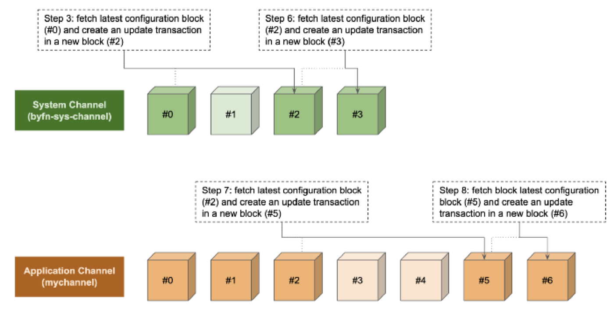
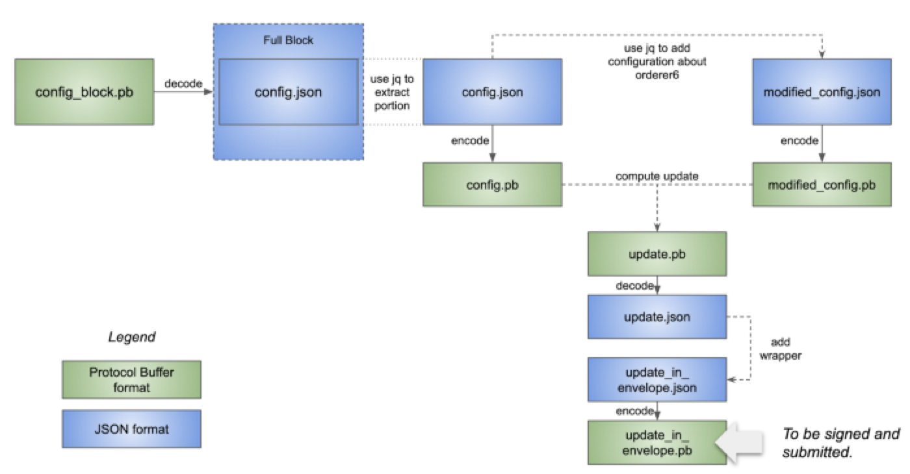

`environment:`    
`mac`   
`Docker version 20.10.8`    
`Docker Compose version v2.0.0-rc.1`    
`fabric v2.0.0`


## 一、概述
   
如上图，我们将orderer节点从5个扩展到6个
步骤:
* 启动网络(raft共识)
* 准备orderer6证书
* 增加orderer6 tls证书到系统通道
* 获取最新区块作为orderer6的创世区块
* 启动orderer6节点容器
* 增加orderer6节点信息到系统通道
* 增加orderer6 tls证书到用户通道(可选)
* 增加orderer6节点信息到用户通道(可选)
  
区块变化如下图:
  


脚本执行过程如下图:
   


## 二、搭建网络
### 1、下载镜像以及相关工具包
`https://github.com/hyperledger/fabric/blob/v2.2.0/scripts/bootstrap.sh`内容copy到刚创建的bootstrap.sh文件里面去    
执行以下命令:
```
sh bootstrap.sh
```
下载完后fabric的环境安装完毕

### 2、修改crypto-config文件
我们需要把一个orderer节点扩展成5个orderer节点，需要修改的文件路径为`./fabric-samples/test-network/organizations/cryptogen/crypto-config-orderer.yaml`   
修改的内容如下:

```
OrdererOrgs:
  # ---------------------------------------------------------------------------
  # Orderer
  # ---------------------------------------------------------------------------
  - Name: Orderer
    Domain: example.com
    EnableNodeOUs: true
    # ---------------------------------------------------------------------------
    # "Specs" - See PeerOrgs for complete description
    # ---------------------------------------------------------------------------
    Specs:
      - Hostname: orderer
        SANS:
          - localhost
      - Hostname: orderer2
        SANS:
          - localhost
      - Hostname: orderer3
        SANS:
          - localhost
      - Hostname: orderer4
        SANS:
          - localhost
      - Hostname: orderer5
        SANS:
          - localhost
```

### 3、增加orderer节点的docker启动节点
修改文件路径为`./fabric-samples/test-network/docker/docker-compose-test-net.yaml` 
请参考:`https://github.com/jxu86/fabric-sample-test/blob/master/test-network/docker/docker-compose-test-net.yaml`


### 4、修改configtx.yaml
修改文件路径为`./fabric-samples/test-network/configtx/configtx.yaml`
请参考:`https://github.com/jxu86/fabric-sample-test/blob/master/test-network/configtx/configtx.yaml`

### 5、启动网络
```
cd ./fabric-samples/test-network
sh network.sh up
```

启动成功有以下信息:
```
[+] Running 9/9
 ⠿ Network net_test                  Created                                                                                                                                                                                             0.1s
 ⠿ Container orderer3.example.com    Started                                                                                                                                                                                             2.7s
 ⠿ Container peer0.org2.example.com  Started                                                                                                                                                                                             3.3s
 ⠿ Container orderer.example.com     Started                                                                                                                                                                                             2.8s
 ⠿ Container orderer5.example.com    Started                                                                                                                                                                                             2.9s
 ⠿ Container peer0.org1.example.com  Started                                                                                                                                                                                             3.6s
 ⠿ Container orderer4.example.com    Started                                                                                                                                                                                             3.2s
 ⠿ Container orderer2.example.com    Started                                                                                                                                                                                             2.9s
 ⠿ Container cli                     Started                                                                                                                                                                                             4.3s
CONTAINER ID   IMAGE          COMMAND             CREATED         STATUS                  PORTS                                                 NAMES
839b297480e3   5eb2356665e7   "/bin/bash"         5 seconds ago   Up Less than a second                                                         cli
1da95678635b   760f304a3282   "peer node start"   5 seconds ago   Up 1 second             7051/tcp, 0.0.0.0:9051->9051/tcp, :::9051->9051/tcp   peer0.org2.example.com
0d89ebba2fb5   5fb8e97da88d   "orderer"           5 seconds ago   Up 2 seconds            0.0.0.0:8050->7050/tcp, :::8050->7050/tcp             orderer2.example.com
a86d6691a134   5fb8e97da88d   "orderer"           5 seconds ago   Up 2 seconds            0.0.0.0:9050->7050/tcp, :::9050->7050/tcp             orderer3.example.com
8dc263b51abd   760f304a3282   "peer node start"   5 seconds ago   Up 1 second             0.0.0.0:7051->7051/tcp, :::7051->7051/tcp             peer0.org1.example.com
2a3afac8c33e   5fb8e97da88d   "orderer"           5 seconds ago   Up 2 seconds            0.0.0.0:11050->7050/tcp, :::11050->7050/tcp           orderer5.example.com
0efa0704e13d   5fb8e97da88d   "orderer"           5 seconds ago   Up 1 second             0.0.0.0:10050->7050/tcp, :::10050->7050/tcp           orderer4.example.com
16d01d73e1b3   5fb8e97da88d   "orderer"           5 seconds ago   Up 2 seconds            0.0.0.0:7050->7050/tcp, :::7050->7050/tcp             orderer.example.com
```
### 6、安装通道
```
sh network.sh createChannel
```

## 三、在现有运行的网络增加orderer节点

### 1、生成orderer6证书
修改`./fabric-samples/test-network/organizations/cryptogen/crypto-config-orderer.yaml`增加orderer6
执行以下命令
```
cryptogen extend --config=./organizations/cryptogen/crypto-config-orderer.yaml --input ./organizations
```
### 2、启动orderer-cli的docker
创建`fabric-samples/test-network/docker/docker-compose-orderer-cli.yaml`文件，内容如下:
```
version: '2'

networks:
  test:

services:

  orderer-cli:
    container_name: orderer-cli
    image: hyperledger/fabric-tools:$IMAGE_TAG
    tty: true
    stdin_open: true
    environment:
      - SYS_CHANNEL=$SYS_CHANNEL
      - GOPATH=/opt/gopath
      - CORE_VM_ENDPOINT=unix:///host/var/run/docker.sock
      #- FABRIC_LOGGING_SPEC=DEBUG
      - FABRIC_LOGGING_SPEC=INFO
      - CORE_PEER_ID=cli
      - CORE_PEER_ADDRESS=peer0.org1.example.com:7051
      - CORE_PEER_LOCALMSPID=OrdererMSP
      - CORE_PEER_TLS_ENABLED=true
      - CORE_PEER_TLS_CERT_FILE=/opt/gopath/src/github.com/hyperledger/fabric/peer/crypto/peerOrganizations/org1.example.com/peers/peer0.org1.example.com/tls/server.crt
      - CORE_PEER_TLS_KEY_FILE=/opt/gopath/src/github.com/hyperledger/fabric/peer/crypto/peerOrganizations/org1.example.com/peers/peer0.org1.example.com/tls/server.key
      - CORE_PEER_TLS_ROOTCERT_FILE=/opt/gopath/src/github.com/hyperledger/fabric/peer/crypto/ordererOrganizations/example.com/orderers/orderer.example.com/msp/tlscacerts/tlsca.example.com-cert.pem
      - CORE_PEER_MSPCONFIGPATH=/opt/gopath/src/github.com/hyperledger/fabric/peer/crypto/ordererOrganizations/example.com/users/Admin@example.com/msp
    working_dir: /opt/gopath/src/github.com/hyperledger/fabric/peer
    command: /bin/bash
    volumes:
        - /var/run/:/host/var/run/
        - ../organizations:/opt/gopath/src/github.com/hyperledger/fabric/peer/crypto/
        - ../scripts:/opt/gopath/src/github.com/hyperledger/fabric/peer/scripts/
    networks:
      - test

```
启动orderer-cli容器

```
docker-compose -f docker/docker-compost-orderer-cli.yaml up -d
```

### 3、系统通道增加orderer6 tls信息
创建`fabric-samples/test-network/addOrdererNode/add_tls_sysCh.sh`文件，内容为
```
TLS_FILE=/opt/gopath/src/github.com/hyperledger/fabric/peer/crypto/ordererOrganizations/example.com/orderers/orderer6.example.com/tls/server.crt
docker exec orderer-cli sh -c 'peer channel fetch config config_block.pb -o orderer.example.com:7050 -c system-channel --tls --cafile /opt/gopath/src/github.com/hyperledger/fabric/peer/crypto/ordererOrganizations/example.com/orderers/orderer.example.com/msp/tlscacerts/tlsca.example.com-cert.pem'
docker exec orderer-cli sh -c 'configtxlator proto_decode --input config_block.pb --type common.Block | jq .data.data[0].payload.data.config > config.json'
docker exec -e TLS_FILE=$TLS_FILE orderer-cli sh -c 'echo "{\"client_tls_cert\":\"$(cat $TLS_FILE | base64)\",\"host\":\"orderer6.example.com\",\"port\":10050,\"server_tls_cert\":\"$(cat $TLS_FILE | base64)\"}" > $PWD/org6consenter.json'
docker exec orderer-cli sh -c 'jq ".channel_group.groups.Orderer.values.ConsensusType.value.metadata.consenters += [$(cat org6consenter.json)]" config.json > modified_config.json'
docker exec orderer-cli sh -c 'configtxlator proto_encode --input config.json --type common.Config --output config.pb'
docker exec orderer-cli sh -c 'configtxlator proto_encode --input modified_config.json --type common.Config --output modified_config.pb'
docker exec orderer-cli sh -c 'configtxlator compute_update --channel_id system-channel --original config.pb --updated modified_config.pb --output config_update.pb'
docker exec orderer-cli sh -c 'configtxlator proto_decode --input config_update.pb --type common.ConfigUpdate --output config_update.json'
docker exec orderer-cli sh -c 'echo "{\"payload\":{\"header\":{\"channel_header\":{\"channel_id\":\"system-channel\", \"type\":2}},\"data\":{\"config_update\":"$(cat config_update.json)"}}}" | jq . > config_update_in_envelope.json'
docker exec orderer-cli sh -c 'configtxlator proto_encode --input config_update_in_envelope.json --type common.Envelope --output config_update_in_envelope.pb'
docker exec orderer-cli sh -c 'peer channel update -f config_update_in_envelope.pb -c system-channel -o orderer.example.com:7050 --tls true --cafile /opt/gopath/src/github.com/hyperledger/fabric/peer/crypto/ordererOrganizations/example.com/orderers/orderer.example.com/msp/tlscacerts/tlsca.example.com-cert.pem'

docker exec orderer-cli sh -c 'peer channel fetch config latest_config.block -o orderer.example.com:7050 -c system-channel --tls --cafile /opt/gopath/src/github.com/hyperledger/fabric/peer/crypto/ordererOrganizations/example.com/orderers/orderer.example.com/msp/tlscacerts/tlsca.example.com-cert.pem'
docker cp orderer-cli:/opt/gopath/src/github.com/hyperledger/fabric/peer/latest_config.block ./system-genesis-block/latest_config.block
```
运行脚本
```
sh addOrdererNode/add_tls_sysCh.sh
```

### 4、启动orderer6的docker节点
创建`fabric-samples/test-network/docker/docker-compose-orderer6.yaml`文件，内容如下:
```
networks:
  test:

services:

  orderer6.example.com:
    container_name: orderer6.example.com
    image: hyperledger/fabric-orderer:$IMAGE_TAG
    environment:
      - FABRIC_LOGGING_SPEC=INFO
      - ORDERER_GENERAL_LISTENADDRESS=0.0.0.0
      - ORDERER_GENERAL_LISTENPORT=12050
      - ORDERER_GENERAL_GENESISMETHOD=file
      - ORDERER_GENERAL_GENESISFILE=/var/hyperledger/orderer/orderer.genesis.block
      - ORDERER_GENERAL_LOCALMSPID=OrdererMSP
      - ORDERER_GENERAL_LOCALMSPDIR=/var/hyperledger/orderer/msp
      # enabled TLS
      - ORDERER_GENERAL_TLS_ENABLED=true
      - ORDERER_GENERAL_TLS_PRIVATEKEY=/var/hyperledger/orderer/tls/server.key
      - ORDERER_GENERAL_TLS_CERTIFICATE=/var/hyperledger/orderer/tls/server.crt
      - ORDERER_GENERAL_TLS_ROOTCAS=[/var/hyperledger/orderer/tls/ca.crt]
      - ORDERER_KAFKA_TOPIC_REPLICATIONFACTOR=1
      - ORDERER_KAFKA_VERBOSE=true
      - ORDERER_GENERAL_CLUSTER_CLIENTCERTIFICATE=/var/hyperledger/orderer/tls/server.crt
      - ORDERER_GENERAL_CLUSTER_CLIENTPRIVATEKEY=/var/hyperledger/orderer/tls/server.key
      - ORDERER_GENERAL_CLUSTER_ROOTCAS=[/var/hyperledger/orderer/tls/ca.crt]
    working_dir: /opt/gopath/src/github.com/hyperledger/fabric
    command: orderer
    volumes:
        - ../system-genesis-block/latest_config.block:/var/hyperledger/orderer/orderer.genesis.block
        - ../organizations/ordererOrganizations/example.com/orderers/orderer6.example.com/msp:/var/hyperledger/orderer/msp
        - ../organizations/ordererOrganizations/example.com/orderers/orderer6.example.com/tls/:/var/hyperledger/orderer/tls
        - ../data/orderer6.example.com:/var/hyperledger/production/orderer
    ports:
      - 12050:7050
    networks:
      - test
```
启动节点命令
```
docker-compose -f docker/docker-compose-orderer6.yaml up -d
```

### 5、系统通道增加节信息
创建`fabric-samples/test-network/addOrdererNode/add_ep_sysCh.sh`文件，内容为
```
docker exec orderer-cli sh -c 'peer channel fetch config config_block.pb -o orderer.example.com:7050 -c system-channel --tls --cafile /opt/gopath/src/github.com/hyperledger/fabric/peer/crypto/ordererOrganizations/example.com/orderers/orderer.example.com/msp/tlscacerts/tlsca.example.com-cert.pem'
docker exec orderer-cli sh -c 'configtxlator proto_decode --input config_block.pb --type common.Block | jq .data.data[0].payload.data.config > config.json'
docker exec orderer-cli sh -c 'jq ".channel_group.values.OrdererAddresses.value.addresses += [\"orderer6.example.com:12050\"]" config.json > modified_config.json'
docker exec orderer-cli sh -c 'configtxlator proto_encode --input config.json --type common.Config --output config.pb'
docker exec orderer-cli sh -c 'configtxlator proto_encode --input modified_config.json --type common.Config --output modified_config.pb'
docker exec orderer-cli sh -c 'configtxlator compute_update --channel_id system-channel --original config.pb --updated modified_config.pb --output config_update.pb'
docker exec orderer-cli sh -c 'configtxlator proto_decode --input config_update.pb --type common.ConfigUpdate --output config_update.json'
docker exec orderer-cli sh -c 'echo "{\"payload\":{\"header\":{\"channel_header\":{\"channel_id\":\"system-channel\", \"type\":2}},\"data\":{\"config_update\":"$(cat config_update.json)"}}}" | jq . > config_update_in_envelope.json'
docker exec orderer-cli sh -c 'configtxlator proto_encode --input config_update_in_envelope.json --type common.Envelope --output config_update_in_envelope.pb'
docker exec orderer-cli sh -c 'peer channel update -f config_update_in_envelope.pb -c system-channel -o orderer.example.com:7050 --tls true --cafile /opt/gopath/src/github.com/hyperledger/fabric/peer/crypto/ordererOrganizations/example.com/orderers/orderer.example.com/msp/tlscacerts/tlsca.example.com-cert.pem'
```
执行脚本
```
sh addOrdererNode/add_ep_sysCh.sh
```
最后对比orderer6和orderer的区块文件是一样大小，怎么添加orderer6成功了
```
➜  test-network git:(master) ✗ ll data/orderer6.example.com/chains/system-channel/blockfile_000000
-rw-r-----  1 jc  staff   106K Sep  2 15:34 data/orderer6.example.com/chains/system-channel/blockfile_000000
➜  test-network git:(master) ✗ ll data/orderer.example.com/chains/system-channel/blockfile_000000
-rw-r-----  1 jc  staff   106K Sep  2 15:27 data/orderer.example.com/chains/system-channel/blockfile_000000
```


### 6、orderer6添加应用通道
添加已有的用户通道系统通道的步骤是一样的，也是要增加orderer6 tls信息和增加节信息
具体参考:
`https://github.com/jxu86/fabric-sample-test/blob/master/test-network/addOrdererNode/add_tls_appCh.sh`      
`https://github.com/jxu86/fabric-sample-test/blob/master/test-network/addOrdererNode/add_ep_appCh.sh`   


代码请参考:`https://github.com/jxu86/fabric-sample-test`

[文章github地址](https://github.com/jxu86/technique-architect/blob/master/blockchain/fabric/fabric动态增加orderer节点(raft).md)

参考:   
[配置并使用 Raft 排序服务](https://hyperledger-fabric.readthedocs.io/zh_CN/latest/raft_configuration.html#)     
[Add an Orderer to a Running Raft-based Orderer Cluster](https://kctheservant.medium.com/add-an-orderer-to-a-running-raft-based-orderer-cluster-b6a432da138c)   