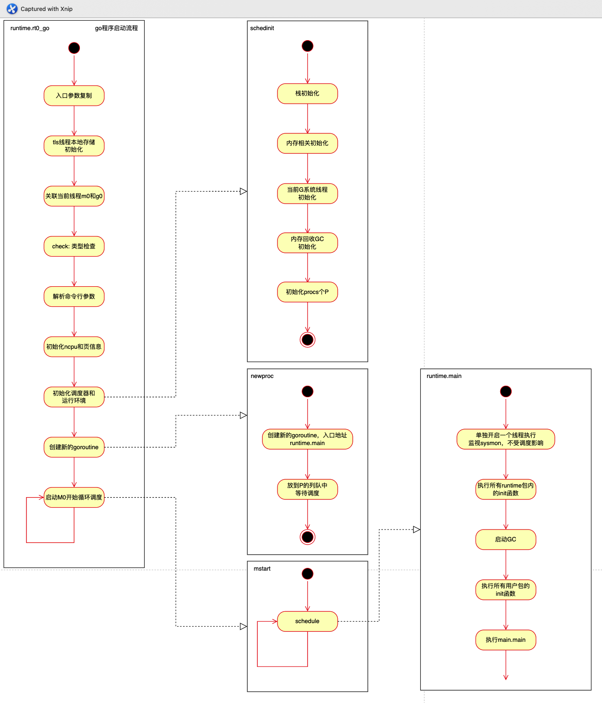
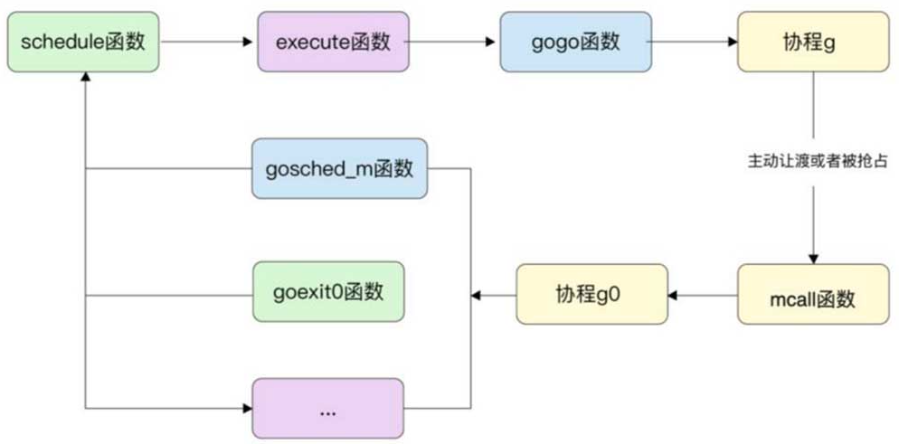
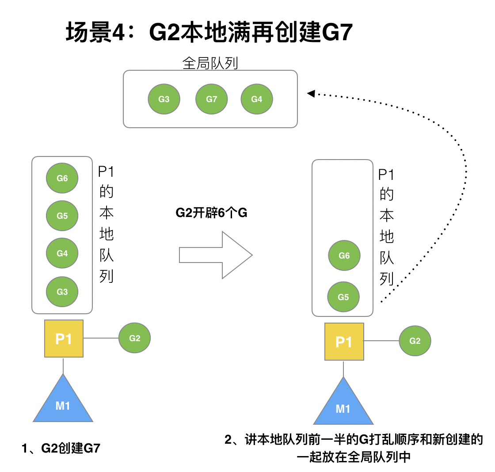
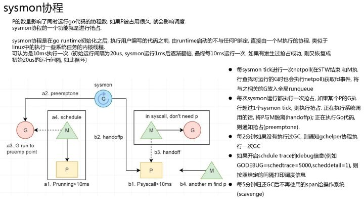

`go1.16.5`

### go启动流程

* 每个 P 都有一个局部队列，负责保存待执行的 G，当局部队列满了就放到全局队列中
* 每个 P 都有一个 M 绑定，正常情况下 M 从局部队列中获取 G 执行
* M 可以从其他队列偷取 G 执行（work stealing），也可以从全局队列获取 G 执行
* 当 G 因系统调用（syscall）阻塞时会阻塞 M，此时 P 会和 M 解绑（hand off），并寻找新的空闲 M，若没有空闲 的M 就会新建一个 M
* 当 G 因 channel 或者 network I/O 阻塞时，不会阻塞 M，M 会寻找其他 runnable 的 G；当阻塞的 G 恢复后会重新进入 runnable 进入 P 队列等待执行
* G 是抢占调度。不像操作系统按时间片调度线程那样，Go 调度器没有时间片概念，G 因阻塞和被抢占而暂停，并且 G只能在函数调用时有可能被抢占(栈扩张)，极端情况下如果 G 一直做死循环就会霸占一个 P 和 M，Go 调度器也无能为力。

### g0的工作原理

### go调度器调度场景

### 抢占式

`Go 的抢占式调度当 sysmon 发现 M 已运行同一个 G（Goroutine）10ms 以上时，它会将该 G 的内部参数 preempt 设置为 true。然后，在函数序言中，当 G 进行函数调用时，G 会检查自己的 preempt 标志，如果它为 true，则它将自己与 M 分离并推入“全局队列”。由于它的工作方式（函数调用触发），在 for{} 的情况下并不会发生抢占，如果没有函数调用，即使设置了抢占标志，也不会进行该标志的检查。Go1.14 引入抢占式调度（使用信号的异步抢占机制），sysmon 仍然会检测到运行了 10ms 以上的 G（goroutine）。然后，sysmon 向运行 G 的 P 发送信号（SIGURG）。Go 的信号处理程序会调用P上的一个叫作 gsignal 的 goroutine 来处理该信号，将其映射到 M 而不是 G，并使其检查该信号。gsignal 看到抢占信号，停止正在运行的 G`

`基于信号的抢占式调度
在之前的依赖栈增长检测代码的方式，遇到没有函数调用的情况下就会出现问题，在Go1.14这一问题得到解决。
在Linux中这种真正的抢占式调度是基于信号完成的，所以也称为“异步抢占”
“异步抢占”工作机制：
M 注册一个 SIGURG 信号的处理函数：sighandler。
sysmon 线程检测到执行时间过长的 goroutine、GC stw 时，会向相应的 M（或者说线程，每个线程对应一个 M）发送 SIGURG 信号。
收到信号后，内核执行 sighandler 函数，通过 pushCall 插入 asyncPreempt 函数调用。
回到当前 goroutine 执行 asyncPreempt 函数，通过 mcall 切到 g0 栈执行 gopreempt_m。
将当前 goroutine 插入到全局可运行队列，M 则继续寻找其他 goroutine 来运行。
被抢占的 goroutine 再次调度过来执行时，会继续原来的执行流。`

参考:    
[Golang 调度原理简单了解](https://zhuanlan.zhihu.com/p/255196396)  
[详尽干货！从源码角度看 Golang 的调度](https://studygolang.com/articles/20651)   
[Golang 系统调用Syscall + RawSyscall](https://www.cnblogs.com/dream397/p/14301620.html)     
[[典藏版] Golang 调度器 GMP 原理与调度全分析](https://learnku.com/articles/41728)    
[【Golang详解】调度机制 抢占式调度](https://blog.51cto.com/u_15107299/3935086)