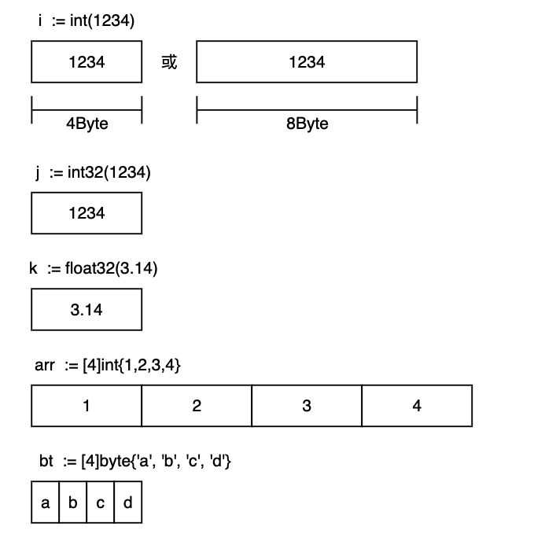
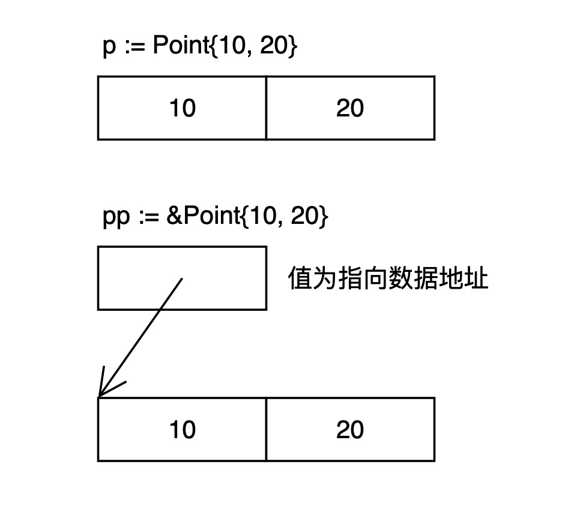
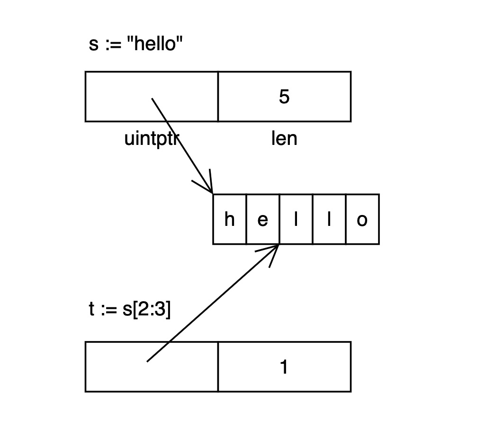
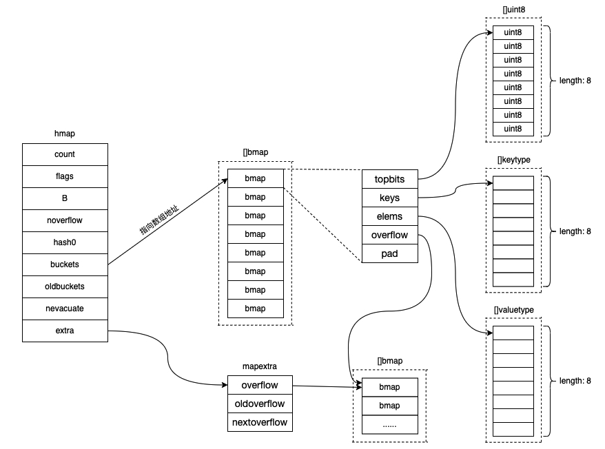
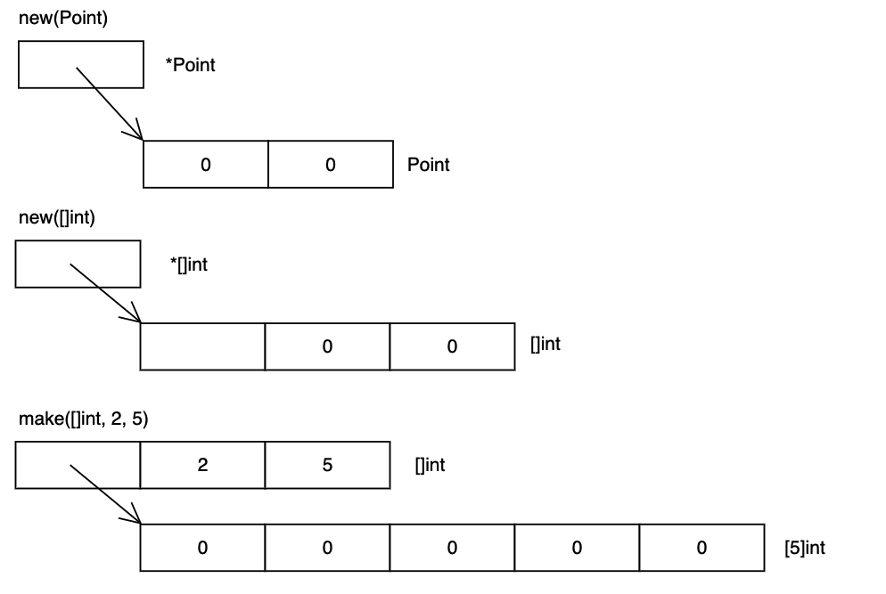

`go 1.16.5`


## 概述

| 类型	         | 长度(字节) | 默认值 | 说明 |
| ------------- | --------- | -------- | --------------------------------------- |
| bool	        | 1	        | false	   |一个字节，值是true或者false，不可以用0或者1表示
| byte	        | 1	        | 0	       |byte占用8位，一个字节，相当于uint8，不带符号位
| rune	        | 4	        | 0	       |Unicode Code Point, int32 等价于int32类型。
| int,uint	    | 4/8	    | 0	       |32 或 64 位，根据平台不同是32位或·者64位
| int8,uint8	|  1	    | 0	       |-128 ~ 127, 0 ~ 255，byte是uint8 的别名
| int16,uint16	|  2	    | 0	       |-32768 ~ 32767, 0 ~ 65535
| int32,uint32	|  4	    | 0	       |-21亿~ 21亿, 0 ~ 42亿，rune是int32 的别名
| int64,uint64	|  8	    | 0	       |
| float32	    |  4	    | 0.0	   |float32小数精确到7位
| float64	    |  8	    | 0.0	   |由于没有double类型，所以float64就是double。float64小数精确到15位
| complex64	    |  8	    | 	       |复数类型
| complex128	| 16	    | 	       |复数类型
| uintptr	    | 4/8	    | 	       |以存储指针的 uint32 或 uint64 整数，指针的长度就是随平台而变
| array			|           |          |值类型
| struct	    |		    |          |值类型
| string		|           | ""	   |UTF-8 字符串
| slice		    |           | nil	   |引用类型
| map		    |           |nil	   |引用类型
| channel		|           |nil	   |引用类型
| interface		|           |nil	   |接口
| function		|           |nil	   |函数

## 基本类型 

   
以上是一些基本类型的存储模型
* `i := 1234`等价于`i := int(1234)`,内存分配的大小取决于平台的位数，32位或64位
* 变量bt的类型是[4]byte，一个由4个字节组成的数组。它的内存表示就是连起来的4个字节，就像C的数组。类似地，变量arr是4个int的数组。


## 结构体和指针
```
type Point struct { X, Y int }
```


* 变量p为已初始化的Point类型结构体，存储为连续内存，长度为2*int
* pp为已初始化的Point类型结构体指针，pp的值为指向Point结构体数据的内存地址


## 字符串

&emsp;&emsp;在Go语言中，字符串不能被修改，只能被访问，不能采取如下方式对字符串进行修改。
字符串的终止有两种方式，一种是C语言中的隐式申明，以字符“\0”作为终止符。一种是Go语言中的显式声明。   



```
// string类型结构
type StringHeader struct {
	Data uintptr
	Len  int
}
```

&emsp;&emsp;字符串在Go语言内存模型中用一个2字长的数据结构表示。它包含一个指向字符串存储数据的指针和一个长度数据。因为string类型是不可变的，对于多字符串共享同一个存储数据是安全的。切分操作str[i:j]会得到一个新的2字长结构，一个可能不同的但仍指向同一个字节序列(即上文说的存储数据)的指针和长度数据。这意味着字符串切分可以在不涉及内存分配或复制操作。这使得字符串切分的效率等同于传递下标。

&emsp;&emsp;`Go语言中所有的文件都采用UTF-8的编码方式，同时字符常量使用UTF-8的字符编码集。`
`普通字母都只占据1字节，但是特殊的字符（例如大部分中文）会占据3字节`


### 字符串拼接


## 切片
&emsp;&emsp;一个切片在运行时由指针（date）、长度（len）和容量（cap）3部分构成。指针指向切片元素对应的底层数组元素的地址。长度对应切片中元素的数目，长度不能超过容量。容量一般是从切片的开始位置到底层数据的结尾位置的长度。

```
// 切片类型结构
type SliceHeader struct {
	Data uintptr
	Len  int
	Cap  int
}
```


## Map
    
相关结构体:
```
type hmap struct {
	// 元素个数，调用 len(map) 时，直接返回此值
	count int
	// 状态标识，比如正在被写、buckets和oldbuckets在被遍历、等量扩容(Map扩容相关字段)
	flags uint8
	// buckets 的对数 log_2, 2^B=len(buckets)
	B uint8 
	// 溢出桶里bmap大致的数量
	noverflow uint16
	// hash因子
	hash0 uint32 
	// 指向一个数组(连续内存空间)，数组的类型为[]bmap
	buckets unsafe.Pointer 
	// 扩容时，存放之前的buckets(Map扩容相关字段)
	oldbuckets unsafe.Pointer 
	// 分流次数，成倍扩容分流操作计数的字段(Map扩容相关字段)
	nevacuate uintptr 
	// 溢出桶结构，正常桶里面某个bmap存满了，会使用这里面的内存空间存放键值对
	extra *mapextra 
}

type bmap struct {
    topbits  [8]uint8    // key获取的hash的高8位，遍历时对比使用，提高性能
    keys     [8]keytype  // 具体的key值
    elems    [8]elemtype // 键值对的key对应的值
    overflow uintptr     // 指向的hmap.extra.overflow溢出桶里的bmap
    pad      uintptr     // 对齐内存使用的，不是每个bmap都有会这个字段，需要满足一定条件
}

type mapextra struct {
    overflow    *[]*bmap
    oldoverflow *[]*bmap
    nextOverflow *bmap
}
```

* 当传参为map的时候，其实传递的是指针地址。函数内外map的地址都是一样的，函数内部的改变会透传到函数外部。
* 没有初始化的map地址都是0，函数内部初始化map不会透传到外部map

## new和make的区别
&emsp;&emsp;make用于内建类型（map、slice 和channel）的内存分配。new用于各种类型的内存分配。
* new(T)返回一个*T，即返回指针
* make只能创建slice、map和channel，并且返回一个有初始值(非零)的T类型




## nil
&emsp;&emsp;按照Go语言规范，任何类型在未初始化时都对应一个零值：布尔类型是false，整型是0，字符串是""，而指针，函数，interface，slice，channel和map的零值都是nil。


参考:           
[由浅到深，入门Go语言Map实现原理](https://studygolang.com/articles/32943)      
[Golang map实践以及实现原理](https://blog.csdn.net/u010853261/article/details/99699350)
